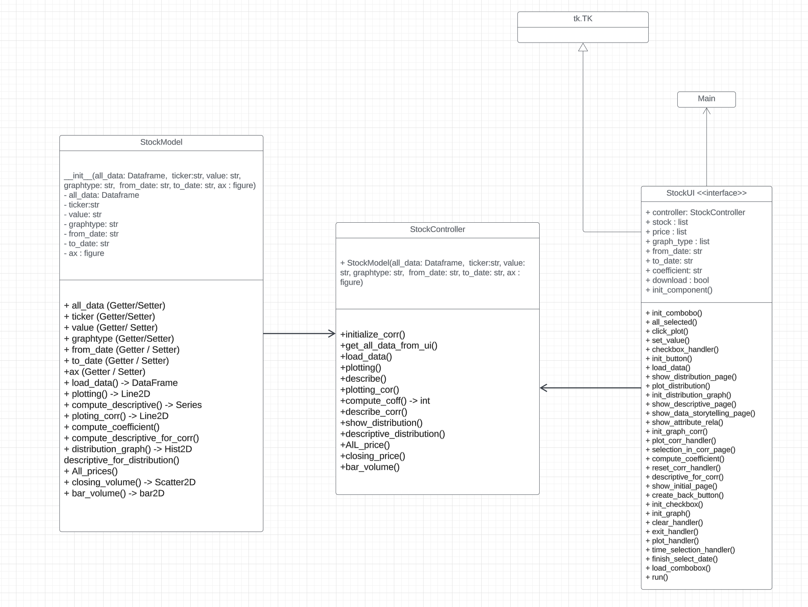

# Stock-Analysis
## Description
* This application will analyze the top ten performing stock data by Yahoo!Finance for investors and provide the tendency and volatility of each stock using descriptive statistics and correlation. 
This helps investors decide whether they should invest or not. Additionally, the application will display essential graphs such as line, bar, and scatter plots.

## Datasource
* The Dataset of this program is provided by yahoo! Finance API [`here`](https://pypi.org/project/yfinance/)  that contain record of each company stock value by date-time.

## How to run
The package needed for this program, yoo can install in requirements.txt file by the command `pip install -r requirements.txt` Then you can run the program in file [`main.py`](main.py)

## Application features
- **Showing graph and Compare attribute**: On the main page, the program will display the graph according to the user interaction.
- **Descriptive Statistics**: Show the descriptive statistics of the user's selection attributes.
- **Distribution**: Show the distribution graph of volume in each of stock.
- **DataStorytelling** Show the line graph of open, high and low prices over the period, the program will display the scatter plot between closing price and volume attributes as well as showing the sales of volume representing by bar graph.
- **Attribute Relationship**: This feature is will show the scatter plot graph and compute the coefficient correlation between the user's selection attributes.

## Design Pattern, UML and Sequence Diagrapm
Design pattern that I used is MVC. by getting the user selected from StockUI. then calling StockController to use the function in StockModel

